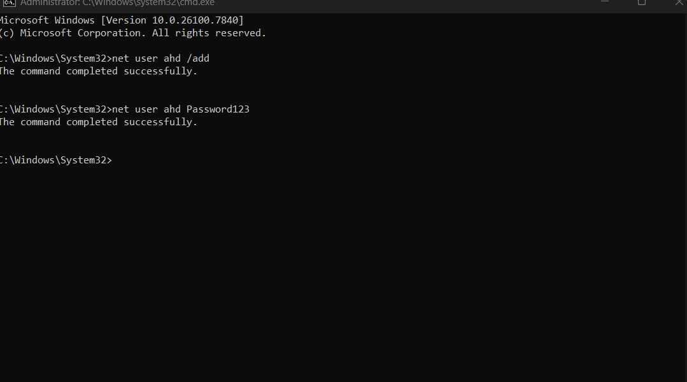
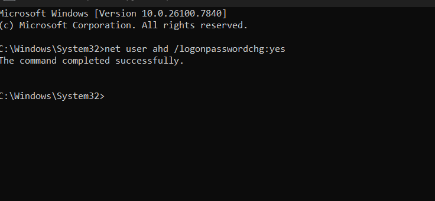

# User Account Management Lab
**Ahad Sattar | IT Support Lab | Windows & Linux**

---

## Objective

To demonstrate user account management from the command line on both Windows 10 and Kali Linux, covering user creation, password assignment, forced password change on next logon, and user verification.

---

## Environment

- **Windows 10** — CMD (run as Administrator)
- **Kali Linux** — Terminal (sudo privileges)

---

## Windows — User Management via CMD

### Step 1 — Create a user

```cmd
net user ahd /add
```

This creates a new local user account named `ahd` with no password set. The `/add` flag tells Windows to create rather than modify.

**Output:** `The command completed successfully.`

### Step 2 — Assign a password

```cmd
net user ahd Password123
```

Sets `Password123` as the password for user `ahd`. In a real IT support scenario, this would be a temporary password communicated securely to the user.

**Output:** `The command completed successfully.`



---

### Step 3 — Force password change on next logon

```cmd
net user ahd /logonpasswordchg:yes
```

This flags the account so the user is prompted to set their own password the next time they log in. This is standard IT onboarding practice — the admin never holds the user's final password.

**Output:** `The command completed successfully.`



---

### Step 4 — Delete a user

```cmd
net user ahd /delete
```

Removes the user account entirely from the system.

**Output:** `The command completed successfully.`

---

### Step 5 — Verify a user

```cmd
net user ahd
```

Run this at any point to check account status — confirms whether the account is active, when the password was last set, and whether a forced change is pending.

---

## Linux — User Management via Terminal (Kali)

### Step 1 — Create a user

```bash
sudo useradd John
```

Creates a new user called `John`. The `sudo` prefix is required as only administrators can create users on Linux.

### Step 2 — Verify the user was created

```bash
cat /etc/passwd
```

Displays all users on the system. Scrolling to the bottom confirms `John` was added successfully — visible as the last entry in the file.


---

### Step 3 — Set a password for the user

```bash
sudo passwd John
```

Prompts the admin to enter and confirm a new password for `John`. Output confirms `password updated successfully`.

### Step 4 — Force password change on next logon

```bash
sudo passwd -e John
```

The `-e` flag expires the password immediately. When `John` next logs in, Linux will require them to set a new password before continuing. This mirrors the Windows `/logonpasswordchg:yes` behaviour.

**Output:** `passwd: password changed.`


---

## Key Takeaways

- Both Windows and Linux allow full user lifecycle management from the command line
- Forcing a password change on first logon is best practice in any IT environment — it ensures the admin never retains the user's final credentials
- `net user` on Windows and `useradd`/`passwd` on Linux serve the same purpose but with different syntax
- Verifying changes (`net user <name>` or `cat /etc/passwd`) after every action is good habit and important for documentation

---
